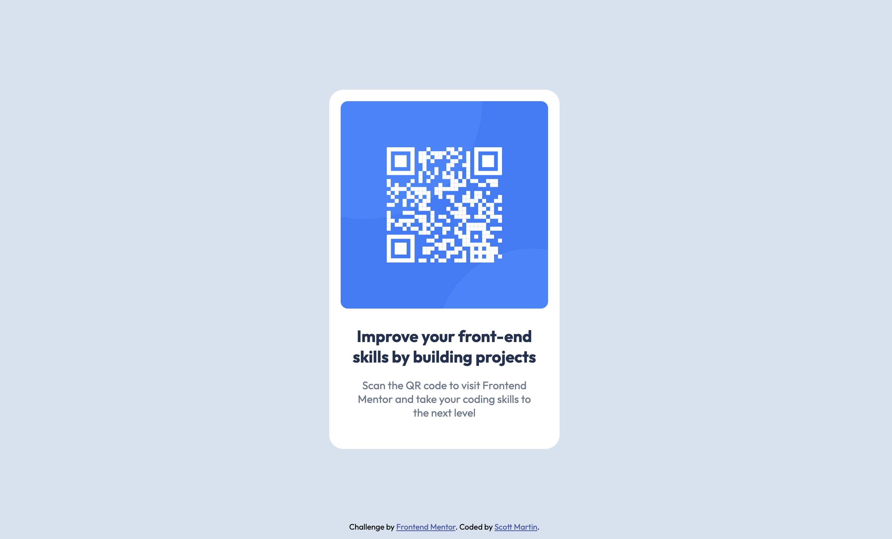

# Frontend Mentor - QR code component solution

This is a solution to the [QR code component challenge on Frontend Mentor](https://www.frontendmentor.io/challenges/qr-code-component-iux_sIO_H). Frontend Mentor challenges help you improve your coding skills by building realistic projects.

## Table of contents

- [Overview](#overview)
  - [Screenshot](#screenshot)
  - [Built with](#built-with)
  - [Continued development](#continued-development)
- [Author](#author)

## Overview

Increasing my practical ability of basic fundamentals by working through some Frontend Mentor challenges. This is the first one.

### Screenshot

### Built with

- Semantic HTML5 markup
- CSS custom properties
- Flexbox

### Continued development

I want to continue working on Frontend Mentor challenges to get more hands-on practice of real-world type scenarios, working from Figma files to build the design.

## Author

- Website - [Scott Martin](https://www.scottmartinwebdevelopment.com)
- Frontend Mentor - [@smartinuk88](https://www.frontendmentor.io/profile/smartinuk88)
